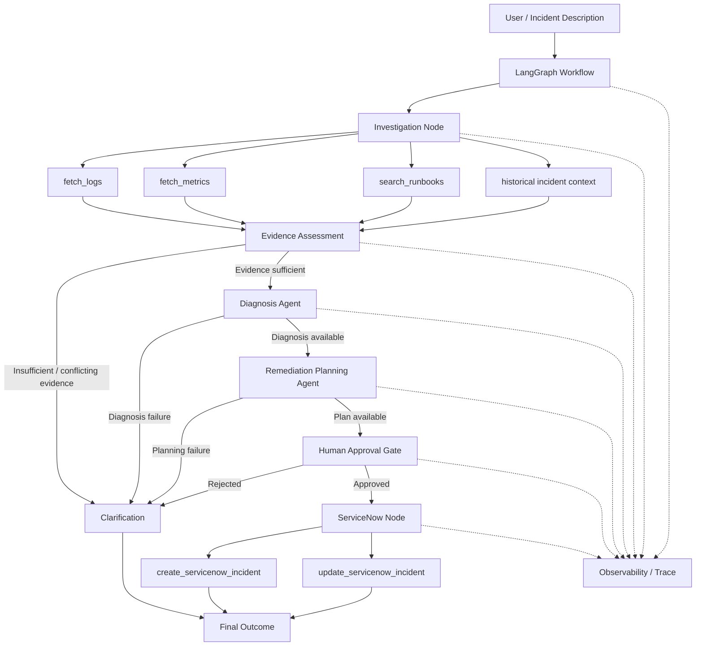

# Architecture — ServiceNow Incident Copilot

## 1. Overview

The ServiceNow Incident Copilot is an explicit LangGraph-based workflow for incident investigation and remediation planning.

The workflow separates:

- incident investigation,
- evidence assessment,
- diagnosis,
- remediation planning,
- human approval,
- ServiceNow writes,
- clarification/failure handling, and
- observability.

The LLM is used for evidence-grounded reasoning and structured planning. It does **not** directly control ServiceNow writes. ServiceNow create/update operations are behind a deterministic human-approval boundary.

## 2. Architecture Diagram

The following Mermaid diagram shows the end-to-end workflow:



## 3. Workflow

### Step 1 — Incident intake

The workflow receives a structured incident containing:

- incident ID,
- affected service,
- severity,
- title,
- description,
- investigation start time,
- investigation end time.

### Step 2 — Investigation

The investigation node gathers context from four typed tools:

1. `fetch_logs`
2. `fetch_metrics`
3. `search_runbooks`
4. historical incident context

The current implementation uses simulated JSON datasets for these sources.

Each tool returns structured data and records success/failure information for the workflow.

### Step 3 — Evidence assessment

The workflow checks whether enough evidence exists to continue.

It explicitly handles:

- insufficient evidence,
- conflicting evidence,
- tool failures.

When the available context is not safe enough for a diagnosis, the workflow requests clarification rather than forcing an LLM-generated root cause.

### Step 4 — Diagnosis

The diagnosis agent uses structured output to produce:

- likely root cause,
- confidence,
- reasoning,
- supporting evidence.

Diagnosis validation checks that cited evidence corresponds to available investigation sources and prevents unsupported confidence.

### Step 5 — Remediation planning

The remediation agent creates a structured remediation plan containing:

- incident summary,
- likely root cause,
- confidence,
- evidence,
- recommended actions,
- rollback plan,
- proposed ServiceNow update.

Every remediation action is required to have `requires_approval=true`.

The remediation agent proposes actions; it does not execute them.

### Step 6 — Human approval

A hard approval boundary is placed before ServiceNow writes.

The workflow can produce:

- `approved`,
- `rejected`, or
- `pending`.

A rejection routes the workflow to clarification/revision handling.

### Step 7 — ServiceNow

Only an approved workflow can reach the ServiceNow write node.

Depending on whether an incident ID already exists, the workflow can:

- create a ServiceNow incident, or
- update an existing ServiceNow incident.

The ServiceNow integration also includes validation, duplicate prevention/idempotency handling, structured success/error responses, and tracing.

### Step 8 — Final outcome

The final state records the outcome, including diagnosis/remediation information and ServiceNow execution status where applicable.

Clarification paths terminate without performing a ServiceNow write.

## 4. Safety Boundaries

The architecture intentionally separates reasoning from execution.

```text
LLM reasoning
     |
     v
Structured diagnosis
     |
     v
Structured remediation plan
     |
     v
Human approval
     |
     +---- rejected ---> no ServiceNow write
     |
     +---- approved ---> ServiceNow write
```

This means the model cannot directly decide to execute an operational change.

The ServiceNow node independently checks the approval state before allowing a write.

## 5. Failure and Conditional Paths

The workflow supports explicit conditional behavior:

- tool failure → bounded retry → clarification if retries are exhausted,
- insufficient evidence → clarification,
- conflicting evidence → clarification,
- diagnosis failure → clarification,
- remediation planning failure → clarification,
- approval rejection → clarification/revision path,
- approval pending → workflow remains at the approval boundary.

This prevents the workflow from treating every incident as successfully diagnosable.

## 6. Observability

Each workflow execution has a run ID.

Tracing records:

- node execution,
- tool calls,
- tool inputs/outputs with sensitive values redacted,
- execution status,
- latency,
- approval decisions,
- ServiceNow operation/status,
- final outcome.

This provides traceability from the original incident through investigation and approval to the final ServiceNow operation.

## 7. External Systems

### Current implementation

The project uses:

- simulated logs,
- simulated metrics,
- simulated runbooks,
- simulated historical incidents,
- ServiceNow Personal Developer Instance for ServiceNow integration.

### Production replacement

In a production environment, the simulated sources would be replaced by controlled integrations with enterprise logging, monitoring, knowledge/runbook and historical incident systems.

The ServiceNow integration would use production environment credentials and enterprise security controls.

## 8. Design Principle

The main architectural principle is:

> **Use the LLM for reasoning, but keep workflow control, validation, approval, and operational writes deterministic.**

This provides agentic behavior while reducing the risk of hallucinated evidence, unsafe remediation execution, and unauthorized ServiceNow changes.
